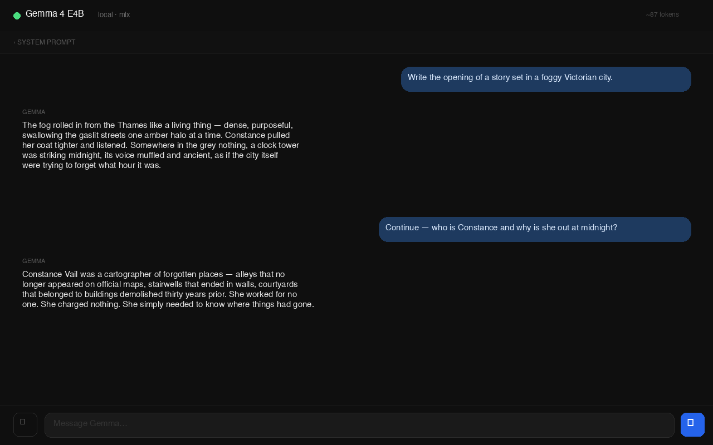

# Gemma 4 Local Chat

A minimal, privacy-first chat interface that runs **Google's Gemma 4 entirely on your Mac** — no internet connection required after setup, no API keys, no data leaving your device.

Built with [MLX](https://github.com/ml-explore/mlx) (Apple's machine learning framework) and Flask.



---

## Requirements

- Apple Silicon Mac (M1 / M2 / M3 / M4)
- macOS 13+
- ~6 GB free disk space
- Python 3.10+ (install with `brew install python@3.12`)

---

## Quick Start

```bash
git clone https://github.com/Vale717171/gemma4-local-chat

cd gemma4-local-chat
bash setup.sh
```

The setup script will:
1. Create a Python virtual environment
2. Install all dependencies
3. Place a **Gemma Chat** shortcut on your Desktop

On first launch, the model (~5 GB) is downloaded automatically from HuggingFace.

---

## Usage

**Double-click** `Gemma Chat` on your Desktop.

- A terminal window opens and loads the model (~15 seconds)
- Your browser opens automatically at `http://localhost:5000`
- Close the terminal to stop the server

### System Prompt

Click **System Prompt** at the top to set a persistent instruction for the model. It is saved locally in your browser and applied to every message. Perfect for roleplay, story generation, or specialized assistants.

### Story / Memory mode

The full conversation history is sent to the model on every message — it remembers everything said in the current session. Use it to collaboratively write stories, build worlds, or explore ideas across many turns.

---

## Model

[`mlx-community/gemma-4-e4b-it-8bit`](https://huggingface.co/mlx-community/gemma-4-e4b-it-8bit)

- ~4B active parameters (MoE architecture)
- 8-bit quantization
- ~9 GB RAM usage
- ~19 tokens/second on M4

---

## Project Structure

```
gemma4-local-chat/
├── server.py        # Flask backend — loads model, handles /chat
├── index.html       # Chat UI (vanilla HTML/CSS/JS)
├── launch.command   # macOS launcher script
├── setup.sh         # One-time setup script
└── requirements.txt
```

---

## Privacy

Everything runs locally. No data is sent anywhere. The only network request is the one-time model download from HuggingFace.

---

## Support

If this saved you time or sparked an idea:

☕ [Buy me a coffee](https://buymeacoffee.com/Vale71)

---

## License

MIT
